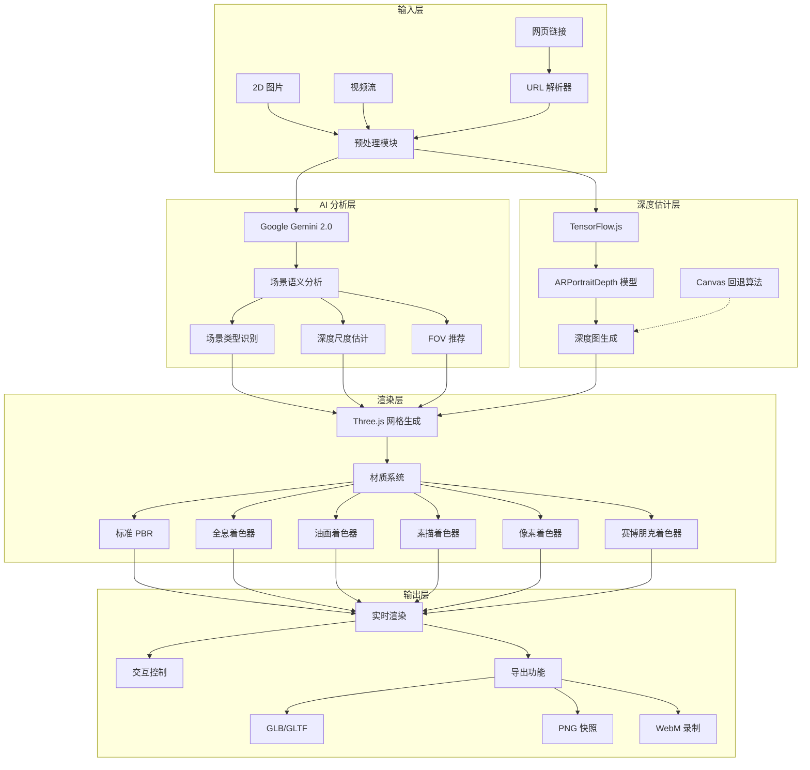
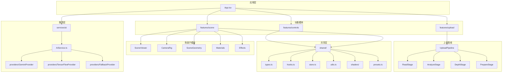

# Immersa 3D 白皮书

<div align="center">

## 🌐 AI 驱动的单视图 2D→3D 沉浸式场景重建系统

**版本 1.0.0 | 2026-01-12**


[快速开始](#快速开始) · [核心功能](#核心功能) · [技术架构](#技术架构) · [API 参考](#api-参考) · [开发指南](#开发指南)

</div>

---

## 目录

1. [项目愿景](#项目愿景)
2. [核心技术管线](#核心技术管线)
3. [快速开始](#快速开始)
4. [核心功能](#核心功能)
5. [技术架构](#技术架构)
6. [项目结构](#项目结构)
7. [配置系统](#配置系统)
8. [API 参考](#api-参考)
9. [平台支持](#平台支持)
10. [开发指南](#开发指南)
11. [性能优化](#性能优化)
12. [安全与隐私](#安全与隐私)
13. [许可证](#许可证)
14. [致谢](#致谢)

---

## 项目愿景

**Immersa 3D** 致力于通过先进的 AI 技术，将普通的 2D 图片和视频转换为可交互的 3D 沉浸式场景，让每个人都能轻松创建惊艳的三维视觉体验。

### 设计理念

- **零门槛**：无需 3D 建模经验，上传即可生成
- **实时预览**：所有参数调整即时反馈
- **多风格支持**：从写实到艺术，覆盖多种视觉需求
- **全平台兼容**：桌面端与移动端自适应体验

---

## 核心技术管线



### 处理流程

1. **输入阶段**：支持本地上传或 URL 链接（含 M3U8 流媒体解析）
2. **AI 分析**：Gemini 识别场景类型并推荐最佳参数
3. **深度估计**：TensorFlow.js 运行 ARPortraitDepth 模型生成深度图
4. **3D 重建**：基于深度图生成位移网格
5. **实时渲染**：应用材质、光照、后期处理
6. **交互输出**：导出模型、截图或录制视频

---

## 快速开始

### 环境要求

| 依赖 | 版本要求 |
|------|----------|
| Node.js | ≥ 18.0.0 |
| npm / pnpm | 最新版本 |
| 浏览器 | 支持 WebGL 2.0 |
| GPU | 推荐独立显卡 |

### 安装步骤

```bash
# 1. 克隆项目
git clone <repository-url>
cd immersa-3d-scene-viewer

# 2. 安装依赖
npm install

# 3. 配置环境变量
echo "VITE_GEMINI_API_KEY=你的密钥" > .env.local

# 4. 启动开发服务器
npm run dev

# 5. 生产构建
npm run build
```

### API 密钥获取

访问 [Google AI Studio](https://aistudio.google.com/) 申请 Gemini API 密钥。

---

## 核心功能

### 渲染风格系统 (6 种)

| 风格 | 标识符 | 描述 | 可调参数 |
|------|--------|------|----------|
| **真实** | `REALISTIC` | PBR 物理材质渲染 | 粗糙度、金属度、曝光 |
| **全息** | `HOLOGRAPHIC` | 科幻全息投影效果 | 扫描线、故障、透明度、速度、色调 |
| **油画** | `PAINTING` | 艺术笔触效果 | 笔触大小 (1-20)、色块化 (2-32) |
| **素描** | `SKETCH` | 铅笔线条风格 | 线条粗细 (0.5-3)、边缘阈值 (0.1-1) |
| **像素** | `PIXEL` | 复古像素艺术 | 像素大小 (2-16)、调色板 (4-64色) |
| **赛博朋克** | `CYBERPUNK` | 霓虹朋克风格 | 霓虹强度 (0-3)、色差 (0-2)、噪点 (0-1) |

### 投影模式系统 (9 种)

| 模式 | 标识符 | 应用场景 |
|------|--------|----------|
| **平面** | `PLANE` | 标准展示，适合人像/产品 |
| **曲面** | `CYLINDER` | 环绕展示，适合全景照片 |
| **弧形** | `SPHERE` | 球面包围，适合天空/风景 |
| **CAVE 影室** | `CORNER` | 三面投影，沉浸式观影 |
| **半球** | `DOME` | 穹顶天幕，天文/航天场景 |
| **全景** | `PANORAMA` | 360° 全景，VR 体验 |
| **盒子** | `CUBE` | 立方体投影，建筑/室内 |
| **全息云** | `GAUSSIAN_SPLAT` | 高斯点云渲染 |
| **万花筒** | `INFINITE_BOX` | 无限镜像空间 |

### 运镜模式系统 (7 种)

| 模式 | 标识符 | 效果描述 |
|------|--------|----------|
| **手动** | `STATIC` | 自由拖拽控制 |
| **轨道** | `ORBIT` | 自动环绕旋转 |
| **飞越** | `FLY_BY` | 电影级穿越效果 |
| **螺旋** | `SPIRAL` | 螺旋上升/下降运动 |
| **环绕** | `ARC` | 弧形往复运动 |
| **紧随** | `TRACKING` | 水平跟踪目标 |
| **希区柯克** | `DOLLY_ZOOM` | 经典眩晕效果 (Dolly Zoom) |

### 色彩分级预设 (12 种)

| 预设 | 效果 |
|------|------|
| 无 (NONE) | 原始色彩 |
| 赛博朋克 (CYBERPUNK) | 高饱和 + 色相偏移 |
| 复古 (VINTAGE) | 褐色调 + 低对比 |
| 黑白 (NOIR) | 100% 灰度 + 高对比 |
| 电影 (CINEMATIC) | 电影 LUT 色调 |
| 梦幻 (DREAMY) | 柔和 + 高亮 |
| VHS (VHS) | 录像带效果 |
| 暖阳 (WARM) | 暖色调滤镜 |
| 胶片 (FILM) | 胶片颗粒感 |
| 日系 (JAPANESE) | 清新淡雅 |
| 冷调 (COLD) | 冷色调滤镜 |
| 棕褐 (SEPIA) | 经典复古 |

### 全息预设 (4 种)

| 预设 | 颜色 | 特点 |
|------|------|------|
| **CLASSIC** | 青色 | 经典科幻全息 |
| **CYBER** | 粉色 | 霓虹赛博风格 |
| **TACTICAL** | 绿色 | 军事战术风格 |
| **GHOST** | 白色 | 幽灵半透明 |

### 镜像模式 (4 种)

- 无镜像 (NONE)
- 水平翻转 (HORIZONTAL)
- 垂直翻转 (VERTICAL)
- 四象限 (QUAD)

---

## 技术架构

### 技术栈总览

| 层级 | 技术 | 版本 | 用途 |
|------|------|------|------|
| **前端框架** | React | 18.3 | UI 组件化开发 |
| **类型系统** | TypeScript | 5.9 | 静态类型检查 |
| **3D 渲染** | Three.js | 0.182 | WebGL 3D 渲染引擎 |
| **React 3D 封装** | @react-three/fiber | 8.17 | 声明式 3D 组件 |
| **3D 工具库** | @react-three/drei | 9.117 | 常用 3D 组件/Hook |
| **AI 分析** | Google Gemini SDK | 1.35 | Gemini 场景分析（Provider 机制，失败自动回退离线模式） |
| **深度估计** | @tensorflow/tfjs | 4.22 | 浏览器端 ML 推理 |
| **深度模型** | @tensorflow-models/depth-estimation | 0.0.4 | ARPortraitDepth |
| **状态管理** | Zustand | 5.0 | 轻量级状态管理 |
| **视频流** | HLS.js | 1.6 | M3U8 流媒体解析 |
| **图标库** | Lucide React | 0.562 | 现代图标系统 |
| **构建工具** | Vite | 6.0 | 高性能构建 |
| **着色器** | vite-plugin-glsl | 1.5 | GLSL 导入插件 |

### 模块依赖关系



## 项目结构

```bash
immersa-3d-scene-viewer/
├── src/
│   ├── App.tsx                       # 应用主入口
│   ├── main.tsx                      # React 挂载点
│   │
│   ├── app/                          # 应用初始化
│   │   ├── AppProviders.tsx          # 全局 Provider 组合
│   │   ├── bootstrap.ts              # 应用启动逻辑
│   │   └── index.ts
│   │
│   ├── core/                         # 核心基础设施
│   │   ├── EventBus.ts               # 事件总线
│   │   ├── EventTypes.ts             # 事件类型定义
│   │   ├── LifecycleManager.ts       # 生命周期管理
│   │   ├── Logger.ts                 # 日志系统
│   │   ├── ErrorHandler.ts           # 错误处理
│   │   ├── PerformanceMonitor.ts     # 性能监控
│   │   ├── domain/                   # 领域类型（纯数据结构）
│   │   ├── logic/                    # 领域编排/配置推导
│   │   └── index.ts
│   │
│   ├── features/                     # 功能模块
│   │   ├── controls/                 # 控制面板模块
│   │   ├── scene/                    # 3D 场景模块
│   │   ├── upload/                   # 上传模块
│   │   └── index.ts
│   │
│   ├── services/                     # 服务层
│   │   ├── ai/                       # AI 服务
│   │   │   ├── AIService.ts          # AI 服务门面（Provider 选择/缓存）
│   │   │   ├── providers/            # AI Provider 实现
│   │   │   │   ├── GeminiProvider.ts
│   │   │   │   ├── TensorFlowProvider.ts
│   │   │   │   └── FallbackProvider.ts
│   │   │   ├── depthEstimation.ts    # 兼容层/旧接口（部分场景可能未使用）
│   │   │   └── index.ts
│   │   ├── shader/                   # 着色器服务
│   │   └── index.ts
│   │
│   ├── shared/                       # 共享模块
│   │   ├── components.tsx            # 共享 UI 组件
│   │   ├── hooks.ts                  # 共享 Hooks
│   │   ├── store.ts                  # Zustand Store（Camera/Scene）
│   │   ├── types.ts                  # TypeScript 类型
│   │   ├── presets.ts                # 预设配置
│   │   ├── shaders/                  # GLSL 着色器
│   │   ├── utils.ts                  # 工具函数
│   │   ├── constants.ts              # 常量定义
│   │   └── ErrorBoundary.tsx         # 错误边界
│   │
│   └── styles.css                    # 全局样式
├── index.html                        # HTML 入口
├── package.json                      # 项目配置
├── tsconfig.json                     # TypeScript 配置
├── vite.config.ts                    # Vite 配置
└── README.md                         # 本文档
```

## 配置系统

### SceneConfig

 核心配置类型位于 `src/shared/types.ts`（`SceneConfig`），默认配置值位于 `src/shared/store.ts`（`DEFAULT_CONFIG`）。

### 状态管理 (Zustand Store)

```typescript
// src/shared/store.ts
export const useSceneStore = create<SceneStore>()(
  devtools(
    subscribeWithSelector((set, get) => ({
      config: DEFAULT_CONFIG,
      setConfig: (updater) => {
        const oldConfig = get().config;
        const changes = typeof updater === 'function' ? updater(oldConfig) : updater;
        const newConfig = { ...oldConfig, ...changes };
        set({ config: newConfig });
      },
    }))
  )
);
```

---

## 🔌 API 参考

### AI 服务

#### `analyzeScene(base64Image: string): Promise<ImageAnalysis>`

使用 AI 服务进行图片语义分析。服务内部采用 Provider 机制（优先 Gemini，失败回退离线默认）。

#### `estimateDepth(imageUrl: string): Promise<DepthResult>`

生成深度图。优先使用 TensorFlow.js（ARPortraitDepth），失败自动回退 Canvas 伪深度算法。

#### `getAIService(): AIService`

AI 功能的统一入口。通常通过 `getAIService()` 获取服务实例后调用上述方法。

#### `getActiveProvider(): string`

返回当前激活的 Provider 组合（scene/depth）。

#### `clearCache(): void` / `configureCaching(config): void`

控制 AI 分析与深度估计结果的本地缓存（TTL/容量）。

### 工具函数

| 函数 | 描述 |
|------|------|
| `extractFrameFromVideo(url, maxSize)` | 从视频提取帧 |
| `resolveWebPageVideoUrl(pageUrl)` | 解析网页中的视频地址 |
| `generatePseudoDepthMap(url, octave)` | Canvas 深度图生成 |
| `generateBlurredBackground(url)` | 生成模糊背景 |
| `resizeImage(url, maxSize)` | 图像缩放 |
| `getImageDimensions(url)` | 获取图像尺寸 |

---

## 📱 平台支持

### 响应式布局

| 断点 | 布局 | 交互方式 |
|------|------|----------|
| **桌面端** (≥768px) | 右侧边栏控制面板 | 鼠标拖拽/滚轮 |
| **移动端竖屏** (<768px) | 底部抽屉 + FAB | 触摸手势 |
| **移动端横屏** | 紧凑抽屉 + 小 FAB | 触摸手势 |

### 浏览器兼容性

| 浏览器 | 最低版本 | WebGL 支持 |
|--------|----------|------------|
| Chrome | 80+ | WebGL 2.0 |
| Firefox | 75+ | WebGL 2.0 |
| Safari | 14+ | WebGL 2.0 |
| Edge | 80+ | WebGL 2.0 |

---

## 🧑‍💻 开发指南

### 可用脚本

```bash
npm run dev          # 启动开发服务器 (HMR)
npm run build        # 类型检查 + 生产构建
npm run preview      # 预览生产构建
npm run type-check   # 仅类型检查
npm run lint         # ESLint 检查
```

### 添加新渲染风格

1. **定义枚举**：`src/core/domain/types.ts` 添加 `RenderStyle` 值
2. **扩展配置**：`src/shared/types.ts` 中的 `SceneConfig` 补充该风格需要的参数
3. **编写着色器**：`src/shared/shaders/` 新增 GLSL 文件（如 `.frag/.vert/.glsl`）
4. **创建材质/映射逻辑**：`src/features/scene/hooks/useSceneMaterials.ts` 增加风格到材质的映射
5. **接入材质更新**：如需根据配置动态更新材质参数，补充 `src/features/scene/hooks/useMaterialUpdater.ts`
6. **添加 UI**：在 `src/features/controls/ControlPanelNew.tsx` 增加对应控制项

### 代码规范

详见项目代码规范文档

| 规则 | 标准 |
|------|------|
| 组件文件 | ≤ 400 行 |
| 函数长度 | ≤ 50 行 |
| Props 数量 | ≤ 7 个 |
| 嵌套层级 | ≤ 4 层 |
| 禁止 | `any` 类型, 硬编码配置, 不使用 memo |

---

## ⚡ 性能优化

### 渲染优化

- **React.memo**：所有功能组件使用 memo 包裹
- **useMemo/useCallback**：缓存计算结果和回调
- **材质复用**：材质实例在组件生命周期内复用
- **LOD 控制**：网格密度可调 (32-512)

### 内存管理

- **Object URL 回收**：自动清理 Blob URL
- **纹理释放**：组件卸载时释放纹理资源
- **HLS 销毁**：视频流正确销毁 HLS 实例

### 加载优化

- **模型预加载**：后台预加载 TensorFlow 模型
- **代码分割**：Vite 自动代码分割
- **资源压缩**：生产构建自动压缩

---

## 🔒 安全与隐私

### 数据处理

- **本地优先**：图像处理在浏览器本地完成
- **AI 传输**：启用 Gemini 时会发送图片的 Base64 数据用于分析（若未配置密钥或 SDK 不可用则自动离线回退）
- **无持久化**：不存储用户上传内容

### API 安全

- **密钥保护**：API 密钥存储在 `.env.local`
- **请求限制**：内置指数退避重试机制

---

## 📜 许可证

MIT License

```
Copyright (c) 2026 Immersa 3D Team

Permission is hereby granted, free of charge, to any person obtaining a copy
of this software and associated documentation files (the "Software"), to deal
in the Software without restriction, including without limitation the rights
to use, copy, modify, merge, publish, distribute, sublicense, and/or sell
copies of the Software...
```

---

## 🙏 致谢

### 核心技术

- [Three.js](https://threejs.org/) - 强大的 3D 渲染引擎
- [React Three Fiber](https://docs.pmnd.rs/react-three-fiber) - React 3D 声明式封装
- [Google Gemini](https://ai.google.dev/) - 先进的 AI 场景分析
- [TensorFlow.js](https://www.tensorflow.org/js) - 浏览器端机器学习
- [ARPortraitDepth](https://github.com/tensorflow/tfjs-models) - 轻量级深度估计模型

### 工具链

- [Vite](https://vitejs.dev/) - 极速开发体验
- [Zustand](https://zustand-demo.pmnd.rs/) - 简洁的状态管理
- [Lucide](https://lucide.dev/) - 精美图标库
- [HLS.js](https://github.com/video-dev/hls.js/) - 流媒体支持

---

<div align="center">

**Immersa 3D** - 让每一帧都成为沉浸式体验

Made with ❤️ by Immersa Team

</div>
